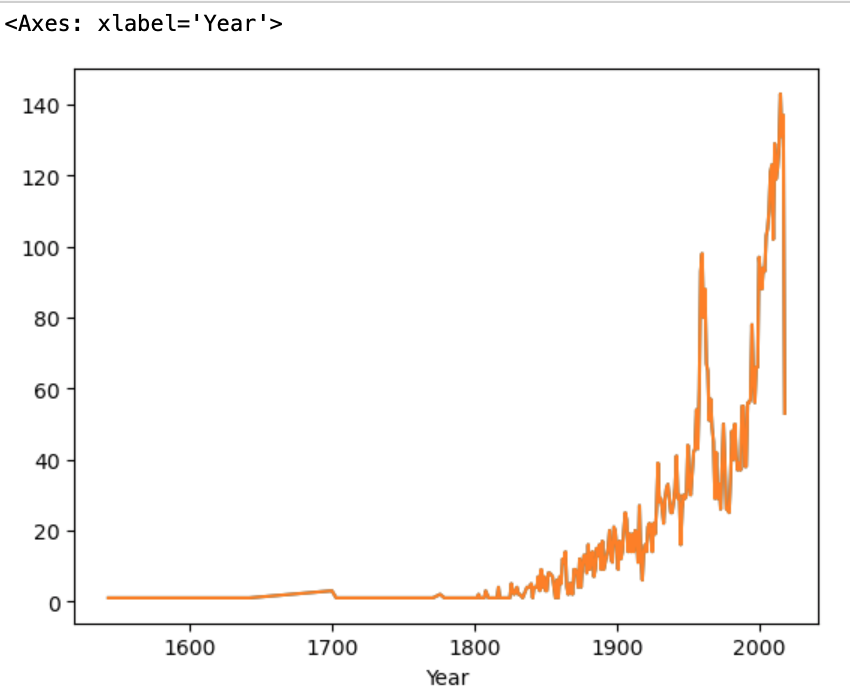
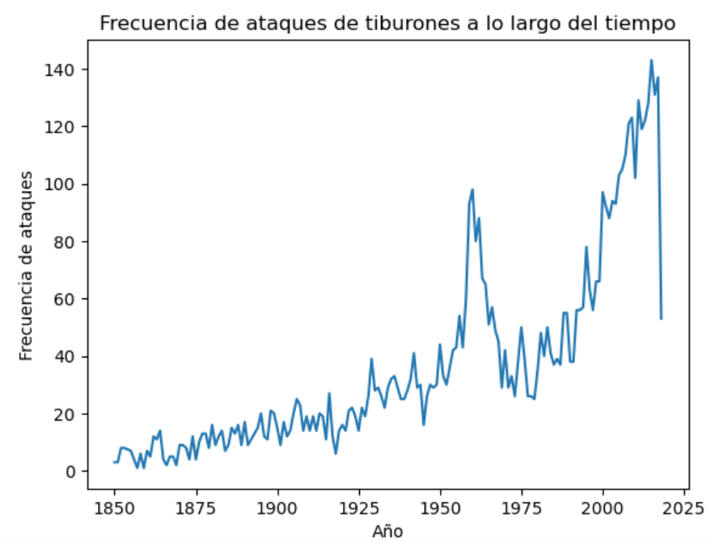
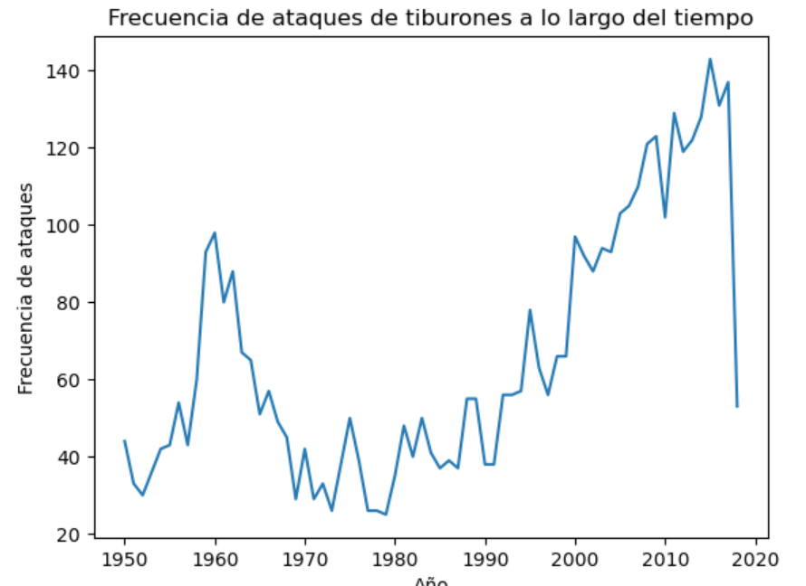
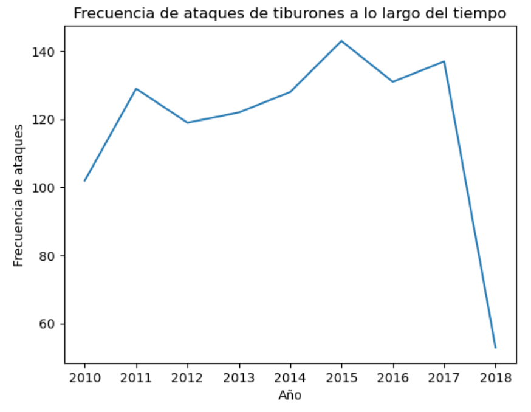
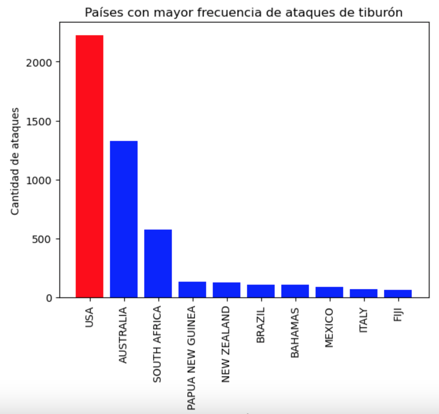
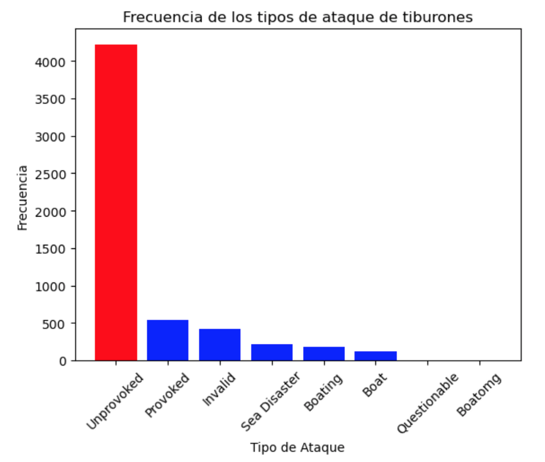
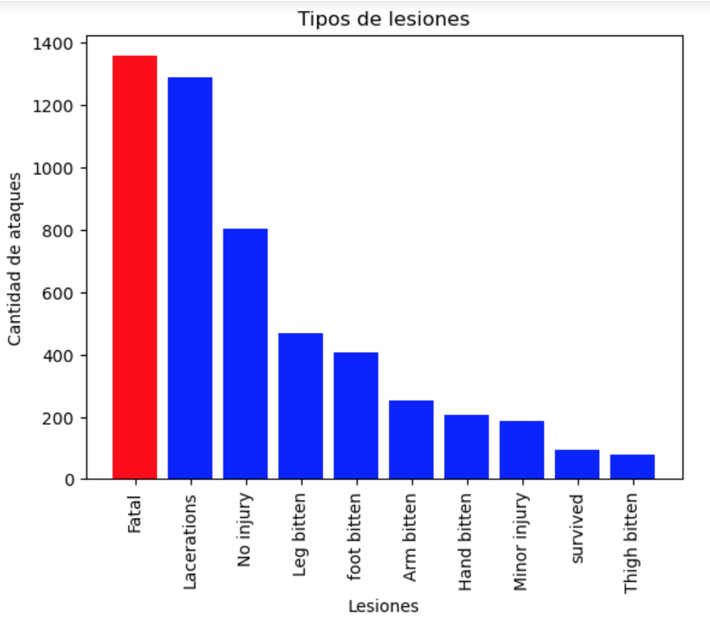

 [![LinkedIn][linkedin-shield]][linkedin-url]
<!-- PROJECT LOGO -->

<div align="center">
  <a href="https://www.kaggle.com/datasets/teajay/global-shark-attacks/">
    
  </a>

  <h3 align="center" style="font-size: 25px">Limpieza y procesamiento de datos con Python</h3>
    <br />
  <p align="center">
    Se analiza el siguiente archivo de Kaggle:
    
 ``Global Shark Attacks``
    <br />
    <br />
      <a href="https://www.kaggle.com/datasets/teajay/global-shark-attacks/">
        
    </a>
    <br />
    <a href="https://www.kaggle.com/datasets/teajay/global-shark-attacks/">Kaggle</a>
    
  </p>
</div> 

## Objetivo

Identificar los patrones y tendencias en los ataques de tiburones a lo largo del tiempo y en diferentes países.

¿Cuáles son los países con mayor incidencia de ataques de tiburones?

¿Ha habido un aumento o disminución en los ataques de tiburones a lo largo de los años?


¿Cuál es el tipo de ataque más común (provocado o no provocado)?

¿Tipo de lesiones causadas por ataques de tiburones? 

## Proceso

Se realiza el proceso a traves de Python.

El conjunto de datos obtenido de Kaggle es muy desordenado y carece de estructura. 

Se procede a  limpiar y manipular los datos sin romper estas dos reglas:

- No eliminar ninguna columna del conjunto de datos

- No tener menos de 2500 filas en el conjunto de datos


¡Empecemos!

## 1. Instalamos las librerias e importamos :
```
%pip install ipython
%pip install seaborn
import pandas as pd
import numpy as np

# para pintar
import pylab as plt    
import seaborn as sns

# para que salga el grafico

%matplotlib inline
```


## 2. Se procede a cargar los datos descargados.
``````
tiburon= pd.read_csv('/Users/esteban/Phyton/w2_project_pandas/data/attacks.csv', encoding= 'latin-1')
``````
## 3. Se realiza la limpieza de los siguientes datos nulos:

```
<class 'pandas.core.frame.DataFrame'>
RangeIndex: 25723 entries, 0 to 25722
Data columns (total 24 columns):
 #   Column                  Non-Null Count  Dtype  
---  ------                  --------------  -----  
 0   Case Number             8702 non-null   object 
 1   Date                    6302 non-null   object 
 2   Year                    6300 non-null   float64
 3   Type                    6298 non-null   object 
 4   Country                 6252 non-null   object 
 5   Area                    5847 non-null   object 
 6   Location                5762 non-null   object 
 7   Activity                5758 non-null   object 
 8   Name                    6092 non-null   object 
 9   Sex                     5737 non-null   object 
 10  Age                     3471 non-null   object 
 11  Injury                  6274 non-null   object 
 12  Fatal (Y/N)             5763 non-null   object 
 13  Time                    2948 non-null   object 
 14  Species                 3464 non-null   object 
 15  Investigator or Source  6285 non-null   object 
 16  pdf                     6302 non-null   object 
 17  href formula            6301 non-null   object 
 18  href                    6302 non-null   object 
 19  Case Number.1           6302 non-null   object 
 20  Case Number.2           6302 non-null   object 
 21  original order          6309 non-null   float64
 22  Unnamed: 22             1 non-null      object 
 23  Unnamed: 23             2 non-null      object 
dtypes: float64(2), object(22)
memory usage: 4.7+ MB 
```
Observo que hay muchas filas en las cuales todos son valores nulos por lo cual no me es útil.
Tras eliminar nos quedamos con 6303 filas.

## 4. Se procede a explorar columnas tras limpieza de valores nulos

Se eliminan 19.421 filas de nulos.

1 - Al analizar se observa la siguiente columna con mas valores nulos es 'time',  para mi objetivo me es indiferente la hora del ataque, por lo cual tomo la decision de volverlo nulo.

2 - las columnas ['Unnamed: 22'], ['Unnamed: 23'] no me aportan nada, por la cual la convierto todo en nulo y trabajo con valores nulos.

### 4.1 Objetivo: trabajar solo con valores validos

Se analizan las siguientes columnas de fecha:

    -Case Number
    -Date
    -Case Number.1
    -Case Number.2

Creamos funciones para cada una de ellas, para devolver valores validos y comparar.

Se toma la decision de trabajar con columna Date, devuelve menos valores nulos.

### 4.2 Objetivo de trabajar solo con validos:

Se necesita igualar datos de valores no validos para empezar a trabajar en el objetivo.

 - Date            6283
 - Country         6252
 - Type            6298
 - Activity        5758
 - Injury          6255 

Tras la exploracion de columnas:

Se igualan los siguientes datos para poder trabajar.

  - Date                    5681
  - Country                 5681
  - Type                    5681
  - Activity                5681
  - Injury                  5681


# 5. Frecuencia de ataque de tiburón.

Una vez igualado, procedemos a analizar los datos:
Se analiza la columna 'Date' y 'Year' para verificar la frecuencia por año.

 Convertimos 'year' en numero para poder trabajar los graficos.

## 5.1 Frecuencia por año de ataques de tiburón

Se Agrupan los datos por año y se cuentan la frecuencia de los ataques

## 5.2 Ataque de tiburon desde el año 1500

Podemos observar que probablemente se hayan perdido bastantes datos o no se han registrado.

<div align="center">
    
</div>

## 5.3 Ataque de tiburon desde el año 1850

A partir del 1850 se ve el incremento de datos, procedemos a observar el cuadro:

 - Dos grandes picos entre el año 1950 - 1975 y entre el 2000 - 20025.
<div align="center">
    
</div>

## 5.4 Ataque de tiburon desde el año 1950 
​
En los años 60 se regitra un pico de ataques por encima de 80 ataques.
<div align="center">
    
</div>

## 5.5 Ataque de tiburon desde el año 2010

Como podemos observar, el pico mas alto se registra en el año 2015 con un total de 136 ataques.
<div align="center">
    
</div>

# 6. Top 3 de los años con más ataques registrados

    Año.    Ataques.
    2015    136
    2017    129
    2016    125

# 7. Frecuencia de ataques registrados por país 

Se observa que el pais con mas ataques registrados es USA con un total de 2.089 ataques.

En el top 10 se encuentran los siguientes paises:

Paises

- USA                 2.089
- AUSTRALIA           1.211
- SOUTH AFRICA         532
- NEW ZEALAND          119
- PAPUA NEW GUINEA     110
- BAHAMAS              104
- BRAZIL               101
- MEXICO                83
- ITALY                 62
- REUNION               56

## 7.1 Grafica top10 frecuencia de ataques registrados por país 

Observamos que Estados unidos es el pais con mas registros en ataques de tiburon
<div align="center">
    
</div>

# 8. Identificar tipo de ataque más común.
​
Se observa que los ataques no fueron provocados.
​
- Unprovoked      4565
- Provoked         573
- Invalid          539
- Sea Disaster     233
- Boating          202
- Boat             135
- Questionable       2
- Boatomg            1

## 8.1 Grafica tipo de ataque más común

<div align="center">
    
</div>

## 9. Identificar el tipo de lesion por ataque.¶

Se analizan los datos y se procede agrupar tipo de lesiones para identificar las principales lesiones.

# 9.1 Principales lesiones

Se observa que la mayoria de los ataques fueron mortales, seguido de laceraciones.

- Fatal           1357
- Lacerations     1289
- No injury        803
- Leg bitten       469
- foot bitten      406
- Arm bitten       253
- Hand bitten      206
- Minor injury     187
- survived          96
- Thigh bitten      77

## 9.2 Grafica principales lesiones.
<div align="center">
    
</div>

## Recursos

[Data Cleaning Tutorial](https://www.tutorialspoint.com/python/python_data_cleansing.html)

[Data Cleaning with Numpy and Pandas](https://realpython.com/python-data-cleaning-numpy-pandas/#python-data-cleaning-recap-and-resources)

[Data Cleaning Video](https://www.youtube.com/watch?v=ZOX18HfLHGQ)

[Data Preparation](https://www.kdnuggets.com/2017/06/7-steps-mastering-data-preparation-python.html)

[Google Search](https://www.google.es/search?q=how+to+clean+data+with+python)
  


<!-- MARKDOWN LINKS & IMAGES -->
<!-- https://www.markdownguide.org/basic-syntax/#reference-style-links -->
[linkedin-shield]: https://img.shields.io/badge/-LinkedIn-black.svg?style=for-the-badge&logo=linkedin&colorB=555
[linkedin-url]: https://www.linkedin.com/in/esteban-cardona-60163685/